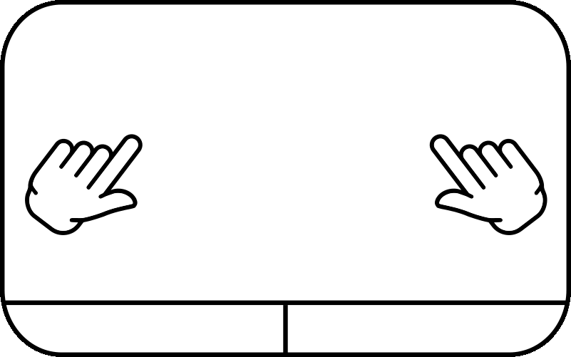

# Touchpad Heart Gesture

This is a fun little program that defines a two-finger touchpad gesture having a heart shape, just as in the animation:

Customize the `config.h` file with the command you want to run when the heart gesture is detected, whether or not you want to save the tracked points, and the path of your touchpad. You can find that path by following [these instructions.](https://stackoverflow.com/a/51378906)

Compile the program using `build.sh` and run with `sudo ./touchpad`.
